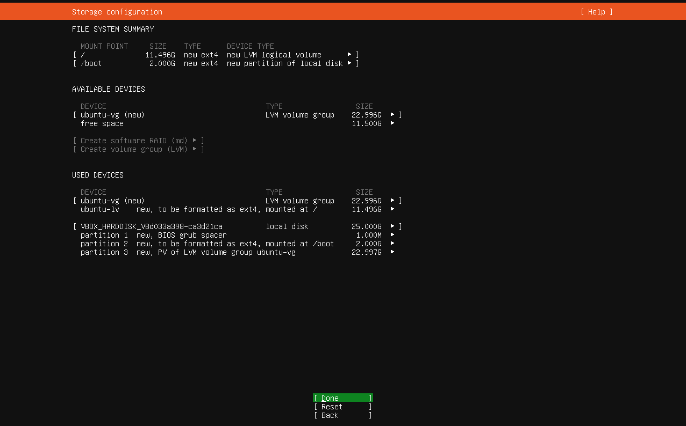
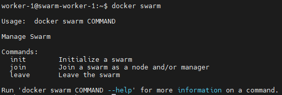

# Lab 4 - Gestion d’un cluster Docker SWARM

## Notes avant de démarrer

Le logiciel de virtualisation utilisé ici est VirtualBox : Il vous est conseillé de l'utiliser également pour vous appuyer ensuite sur les instructions du lab.

Vous pouvez utiliser tout autre logiciel de virtualisation pour réaliser les actions décrites tout au long de ce lab.

Concernant le réseau pour l'interconnexion des noeuds du cluster SWARM, un réseau NAT est utilisé dans ce lab.

Si cela fonctionne sur votre poste, vous êtes invités à utiliser un **[réseau bridge](https://www.virtualbox.org/manual/ch06.html#network_bridged)** pour plus de simplicité.

## Introduction

Dans ce lab, vous gèrerez un cluster Docker SWARM composé de 3 machines virtuelles hébergées sur votre poste de travail :

Le cluster contiendra 1 noeud Manager/Leader et 2 noeuds Workers.

## 1. Création des noeuds

### Téléchargement de l'image OS

Depuis la [page de téléchargement des imaes Ubuntu Server](https://ubuntu.com/download/server), téléchargez sur votre poste de travail l'image de l'OS **Ubuntu 24.04.1 LTS**.

### Création des VMs

- Lancez VirtualBox et sélectionnez **Machine > Nouvelle** :

- Dans la fenêtre qui s'ouvre, remplissez les champs tels qu'indiqué ci-dessous :
    - **Nom** - swarm-manager, worker-1 et worker-2 (selon la VM que vous créez)
    - **Folder** - le dossier dans lequel vous souhaitez que vos VMs soient stockées
    - **ISO Image** - sélectionnez le fichier ISO que vous avez téléchargé
    - **Skip Unattended Installation** - coché

Les champs Type, Subtype et Version se remplissent automatiquement :

- Rendez vous dans l'onglet **Hardware** et attribuez **2Go de RAM** et **1 CPU Core** à la VM :

- Rendez vous dans l'onglet **Hard Disks** et attribuez **25Go** d'espace disque à la VM :

- Cliquez sur **Finish** pour lancer la création de la VM.

### Création du réseau NAT

Les VMs seront interconnectées via un **[réseau NAT](https://www.virtualbox.org/manual/ch06.html#network_nat_service)** : L'utilisation d'un réseau NAT permets aux VMs de communiquer entre elles, avec la machine hôte et également avec l'extérieur.

- Dans la barre d'outil de Virtual Box, sélectionnez **Fichier > Outils > Network Manager** :

- Allez dans l'onglet **NAT Networks** et cliquez sur **Créer** :

### Configuration réseau

- Pour chaque VM, faites un clic-droit et sélectionnez **Configuration...** :

- Rendez vous dans l'onglet **Réseau** et remplissez les champs qu'indiqué ci-dessous :
    - **Mode d'accès réseau** - Réseau NAT
    - **Name** - NatNetwork (le nom du réseau NAT que vous avez créé)
    - **Mode promiscuité** - Allow All

### Installation d'Ubuntu

Installez Ubuntu sur les 3 VMs en suivant les instructions qui suivent.

- Lancez la VM en effectuant un clic-droit dessus puis en sélectionnant **Démarrer > Démarrage normal** :

- Sélectionnez **Try or Install Ubuntu Server** :

- Sélectionnez le language de l'OS :

- Acceptez la proposition d'utiliser la dernière version de l'installer pour l'installation :

- sélectionnez le language du clavier :

- Choisissez le type d'installation **Ubuntu Server** :

- Laissez les valeurs par défauts au niveau de la configuration réseau et passez à la suite :

- Faites de même sur la page de configuration du proxy :

- Attendez qu'ubuntu finisse de tester l'adresse de miroir par défaut et passez à la suite :

- Laissez les valeurs par défauts au niveau du disque et passez à la suite :

- Ubuntu vous affiche un résumé de la configuration du stockage, passez à la suite :

- Une pop-up apparaît vous disant que l'installation va démarrer et par conséquent formater le disque virtuel, sélectionner **Continue** :

- Dans la fenêtre suivante, remplissez librement les champs sauf **Your servers name** qui doit avoir la valeur **swarm-manager**, **swarm-node-1** ou **swarm-node-2** :

- Refusez la proposition d'upgrade sur Ubuntu Pro :

- Faites de même pour OpenSSH :

- Faîtes de même pour les paquets qui vous sont proposés :

L'installation démarre. Une fois terminée, rebootez la VM :

### Test de connectivité

- Connectez-vous sur chaque VM et identifiez leur adresse IP à l'aide de la commande `ip a`.

- Depuis chaque VM, effectuez un ping sur les 2 autres pour confirmer que l'interconnexion est fonctionnelle.

- (Optionel) Depuis chaque VM, ajoutez les entrées DNS des 2 autres dans le fichier **/etc/hosts**.

### Configuration de la redirection de ports

Pour que les VMs soient joignables (en SSH par exemple) depuis la machine hôte, il est nécessaire de configurer une redirection de port. L'accès à chaque VM se fera ensuite via l'adresse 127.0.0.1:{port-source} qui aura pour destination {adresse-vm-réseau-NAT}-{port-cible}.

- Dans la barre d'outil de Virtual Box, sélectionnez **Fichier > Outils > Network Manager** :

- Dans l'onglet **NAT Networks**, rendez-vous dans l'onglet **Redirection de ports** en bas de fenêtre

- Configuez 3 redirections de ports de manière à ce que :
    - le port 2200 de l'hôte soit redirigé vers le port 22 du noeud Manager
    - le port 2201 de l'hôte soit redirigé vers le port 22 du noeud Worker 1
    - le port 2202 de l'hôte soit redirigé vers le port 22 du noeud Worker 2

- Configurez également les 3 redirections suivantes :
    - le port 8090 de l'hôte soit redirigé vers le port 8080 du noeud Manager
    - le port 8091 de l'hôte soit redirigé vers le port 8080 du noeud Worker 1
    - le port 8092 de l'hôte soit redirigé vers le port 8080 du noeud Worker 2

Les ports 8090, 8091 et 8092 seront utilisés pour accéder aux applications hébergées par les conteneurs qui utilisent le port 8080 de leur hôte.

Cliquez ensuite sur **Appliquer** pour appliquer la configuration.

### Test de connexion SSH

- Installez openssh-server sur les VMs via la commande `sudo apt update && sudo apt install -y openssh-server`

- Connectez vous en SSH aux 3 VMs en utilisant 127.0.0.1:{port-machine-hôte} en adresse et confirmez que la connexion fonctionne :

### Installation de Docker

En vous aidant de la [documentation d'installation de Docker](https://docs.docker.com/engine/install/ubuntu/), installez-le sur les VMs.

Effectuez également les [actions de post-installation](https://docs.docker.com/engine/install/linux-postinstall/) afin de pouvoir utiliser Docker avec un utilisateur non-root.

### 2. Création du cluster SWARM

- Afin d'initialiser le cluster avec le noeud Manager, exécutez la commande `docker swarm init` depuis le **noeud Manager** :

Docker affiche la commande à exécuter sur les workers pour qu'ils rejoignent le cluster. Notez que le Manager doit être accessible par les workers sur le port 2377 afin que l'enregistrement puisse se faire.

La commande **docker swarm join-token manager** permet d'afficher le token à utiliser pour qu'un noeud puisse s'enregistrer dans le cluster en tant que Manager. En effet, il y a un token distinct pour l'enregistrement de noeuds Manager.

- Ajoutez les 2 autres VMs au cluster SWARM en tant que **noeuds Workers** :

- Depuis le **noeud Manager**, listez les noeuds du cluster SWARM en exécutant la commande `docker node ls` :

- Exécutez la même commande depuis l'un des **noeuds Worker** et constatez que cette commande n'est exécutable que depuis un noeud Manager.

- Exécutez la commande `docker swarm` sur le noeud Manager et sur l'un des noeuds Worker et notez que le noeud Manager dispose de plus de commandes :

## 3. Retrait d'un noeud

- Depuis l'un des noeuds Worker, exécutez la commande `docker swarm leave` :

- Exécutez la commande `docker node ls` depuis le noeud Manager et notez le statut du noeud qui vient de quitter le cluster :

- Depuis le noeud Manager, exécutez la commande `docker swarm join-token worker` pour re-afficher la commande :

- Exécutez cette commande pour re-inscrire le worker parti dans le cluster.

- Exécutez la commande `docker node ls` sur le Manager :

On voit que le noeud a rejoint le cluster avec un nouvel ID, et que son ancien ID est toujours listé avec le statut **Down**.

- Exécutez la commande `docker node rm {id-du-worker-down}` pour supprimer cet enregistrement résiduel :

### 4. Bridge vs Overlay

Dans Docker SWARM, toutes les opérations de gestion s'effectuent depuis le(s) noeud(s) Manager.

- Créez le réseau custom suivant avec la commande **docker network create** :
    - **Nom** - custom-bridge
    - **Driver** - bridge
    - **Adresse de sous-réseau** - 180.16.0.0/16

- Exécutez la commande `docker network ls` sur chaque noeud et notez que le réseau **custom-bridge** n'est listé que sur le noeud Manager.

- Créez le service suivant avec la commande **docker service create** :
    - **Nom** - web
    - **Image** - httpd
    - **Version de l'image** - 2.4.62
    - **Réseau** - custom-bridge
    - **Port-binding** - binding du port 8080 du noeud sur le port 80 du conteneur

Vous obtenez une erreur car les services Docker SWARM doivent utiliser exclusivement des réseaux de type **overlay**. En effet, les réseaux de type overlay s'étendent sur l'ensemble des noeuds du cluster SWARM.

- Créez le réseau custom suivant avec la commande **docker network create** :
    - **Nom** - custom-overlay
    - **Driver** - overlay
    - **Adresse de sous-réseau** - 190.16.0.0/16

- Exécutez la commande `docker network ls` sur chaque noeud et notez que le réseau **custom-overlay** n'est listé que sur le noeud Manager.

Dans Docker SWARM, un réseau de type overlay n'est visible sur un noeud worker que si :

- Le service dispose d'une **contrainte de placement** indiquant qu'il doit créer ses conteneurs spécifiquement sur ce noeud
- Un service crée un conteneur sur ce noeud

- Créez le service suivant avec la commande **docker service create** :
    - **Nom** - web
    - **Image** - httpd
    - **Version de l'image** - 2.4.62
    - **Réseau** - custom-overlay
    - **Port-binding** - binding du port 8080 du noeud sur le port 80 du conteneur

- Exécutez la commande `docker service ls` pour confirmer la présence du service **web**.

- Exécutez la commande `docker service ps web` pour lister les conteneurs du service web : Notez que le noeud où se situe le conteneur est affiché.

- Accédez à l'application de votre service via l'URL http://localhost:9090 (qui redirige vers {ip-manager}:8080)

- Accédez-y maintenant via l'URL http://localhost:9091 (qui redirige vers {ip-worker-1}:8080)

- Enfin, accédez-y via l'URL http://localhost:9092 (qui redirige vers {ip-worker-2}:8080)

Confirmez que l'accès à l'application via nimporte quel noeud fonctionne, bien que le conteneur soit hébergé dans seulement l'un d'entre eux. En effet, lorsque le port-binding est configuré, Docker SWARM utilise le réseau par défaut nommé **ingress** pour load-balancer le traffic sur l'ensemble des noeuds du cluster.

### 5. Les contraintes de placement

- Modifiez le service **web** à l'aide de la commande **[docker service update](https://docs.docker.com/reference/cli/docker/service/update/)** pour forcer le service à créer ses conteneurs sur le noeud dont le **hostname** est **swarm-worker-2**.

- Exécutez la commande `docker service ps web` et notez que le conteneur du service a été recréé sur le noeud swarm-worker-2.

- Mettez à jour le service web pour y retirer la contrainte de placement que vous avez paramétré (Docker SWARM ne touchera pas au conteneur du service).

### 6. Les replicas

- Scalez le service web à l'aide de la commande **[docker service scale](https://docs.docker.com/reference/cli/docker/service/scale/)** pour qu'il crée 30 conteneurs.

- Exécutez la commande `docker service ls` et notez que le service **web** a maintenant 30 replicas.

- Exécutez la commande `docker service ps web` et observez comment Docker SWARM a réparti les conteneurs sur les noeuds.

- Exécutez commande `docker ps` sur chaque noeud et notez que seuls les conteneurs hébergés dans le noeud sont listés.

## 7. Création d'une application multi-conteneurs

- Supprimez le service **web** et exécutez la commande `docker system prune -af` pour faire un cleanup de vos ressources Docker.

- Créez l'application **vote-app** (cf. labs 1 et 2) sous forme de stack (n'oubliez pas de builder les images custom au préalable !) :
    - Volume #1
        - **Nom** -  **db-data**
    - Réseau #1
        - **Nom** - front-end
        - **Adresse de sous-réseau** - 172.20.0.0/16
    - Réseau #2
        - **Nom** - back-end
        - **Adresse de sous-réseau** - 172.30.0.0/16
    - Service #1
        - **Nom** - vote-app
        - **Image** - vote
        - **Version de l'imgage** - 1.0-docker-swarm
        - **Nombre de replicas** - 10
        - **Réseaux** - front-end et back-end
        - **Port-binding** - Port **80 des conteneurs** avec le port **5001 du Docker Host**
    - Service #2
        - **Nom** - result-app
        - **Image** - result
        - **Version de l'imgage** - 1.0-docker-swarm
        - **Nombre de replicas** - 10
        - **Réseaux** - front-end et back-end
        - **Port-binding** - Port **80 du conteneur** avec le port **5002 du Docker Host**
    - Service #3
        - **Nom** - worker-app
        - **Image** - worker
        - **Version de l'imgage** - 1.0-docker-swarm
        - **Nombre de replicas** - 5
        - **Réseaux** - back-end
    - Service #4
        - **Nom** - redis
        - **Image** - redis
        - **Version de l'imgage** - alpine
        - **Nombre de replicas** - 5
        - **Réseaux** - back-end
    - Service #5
        - **Nom** - db
        - **Image** - postgres
        - **Version de l'imgage** - 15-alpine
        - **Nombre de replicas** - 1
        - **Valeur de la variable d'environnement POSTGRES_USER** - postgres
        - **Valeur de la variable d'environnement POSTGRES_PASSWORD** - postgres
        - **Réseaux** - back-end
        - **Volume** - Utilisation du volume **db-data** pour persister les données contenues dans le répertoire **/var/lib/postgresql/data**

## 8. Accès à l'application multi-conteneurs

- Configurez les port-forwardings nécessaires pour pouvoir accéder aux services vote-app et result-app
- Accédez à la page de vote via l'URL **http://localhost:5001**
- Votez pour **CATS** ou **DOGS**
- Accédez à la page de résultat via l'URL **http://localhost:5002**
- Vérifiez que votre vote a bien été pris en compte dans les résultats